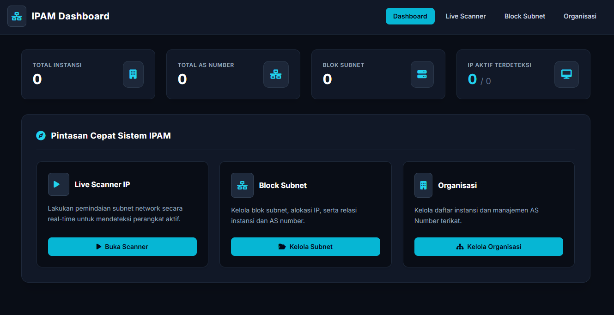

# 🔍 Iseng IP Scanner

Aplikasi web sederhana berbasis PHP dan MySQL untuk melakukan pemindaian IP (*IP Scanning*), pengelolaan subnet, dan manajemen informasi jaringan.

---

## 📸 Preview


---

## ⚙️ Requirements / Kebutuhan Sistem

Pastikan komputer atau server Anda sudah terinstal:
* **Web Server** (Apache / Nginx, seperti yang ada di XAMPP, Laragon, dll.)
* **PHP** (Versi 7.4 atau yang lebih baru)
* **MySQL / MariaDB**

---

## 🚀 Panduan Instalasi & Penggunaan

Ikuti langkah-langkah di bawah ini untuk menjalankan proyek ini di komputer lokal Anda:

### 1. Clone atau Download Repository
Download atau *clone* repositori ini ke dalam direktori *web root* server lokal Anda (misalnya `htdocs` di XAMPP).

```bash
git clone [https://github.com/kiritokun-id/iseng-ip-scanner.git](https://github.com/kiritokun-id/iseng-ip-scanner.git)
